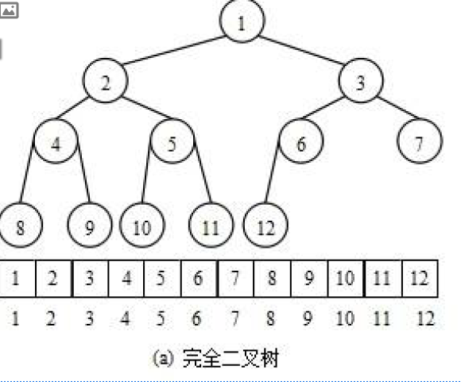
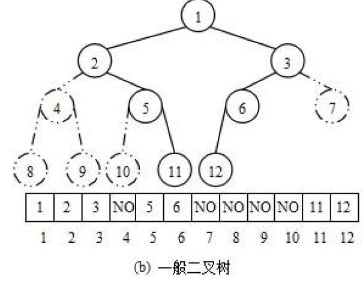
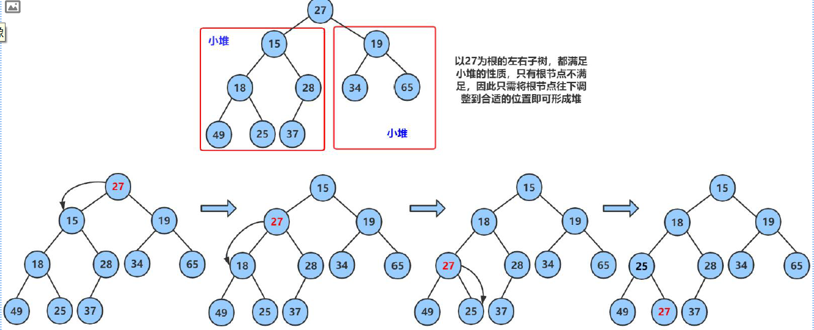
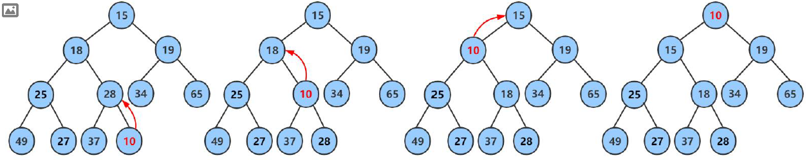
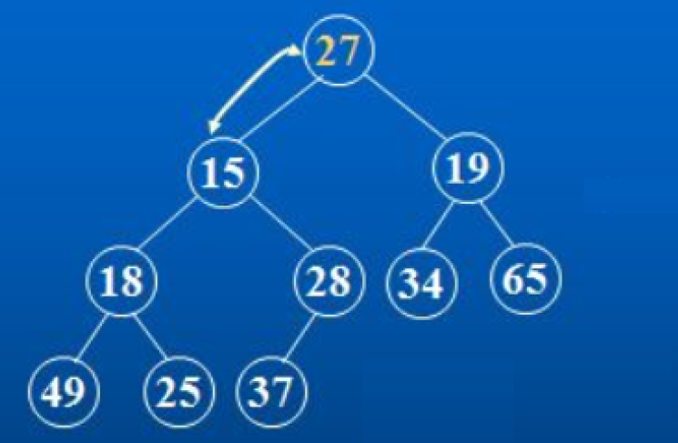

## 目录

- [一、PriorityQueue 的概念](#一priorityqueue-的概念)
- [二、PriorityQueue 简单实现](#二priorityqueue-简单实现)
  - [1. 存储方式](#1-存储方式)
  - [2. 节点设计](#2-节点设计)
  - [3.向下调整](#3向下调整)
  - [4. 向上调整](#4-向上调整)
  - [5. 创建堆](#5-创建堆)
  - [6. 添加元素](#6-添加元素)
  - [7. 删除元素](#7-删除元素)
- [三、PriorityQueue 的实际应用](#三priorityqueue-的实际应用)
  - [1. 构造](#1-构造)
  - [2. 插入/删除/获取指定元素](#2-插入删除获取指定元素)
  - [3. 从默认小根堆转向大根堆](#3-从默认小根堆转向大根堆)
  - [4. 堆排序](#4-堆排序)
  - [5.前 k 大/小的数](#5前-k-大小的数)

> 画师：竹取工坊  
>  大佬们好！我是Mem0rin！现在正在准备自学转码。  
>  如果我的文章对你有帮助的话，欢迎关注我的主页[Mem0rin](https://blog.csdn.net/2501_93882415?spm=1010.2135.3001.10640)，欢迎互三，一起进步！

---

---

PriorityQueue 是用完全二叉树实现的数据结构，用于存在优先级的数据结构，能够让优先级最高的数据优先出队，而不是通常队列的先进先出。

## 一、PriorityQueue 的概念

如果有一个关键码的集合K = {k0，k1， k2，…，kn-1}，把它的所有元素按完全二叉树的顺序存储方式存储 在一个一维数组中，并满足：Ki <= K2i+1 且 Ki<= K2i+2 (Ki >= K2i+1 且 Ki >= K2i+2) i = 0，1，2…，则称为 小堆(或大堆)。将根节点最大的堆叫做最大堆或大根堆，根节点最小的堆叫做最小堆或小根堆。

优先级队列有以下性质：

1. 堆中某个节点的值**总是不大于或不小于其父节点的值**；
2. 堆总是一棵完全二叉树。

## 二、PriorityQueue 简单实现

### 1. 存储方式

虽然用的是二叉树，但是我们并不用之前的链式结构进行存储，而是采用顺序结构的设计。在数组里的对应关系如下图：  
 

在这样的结构中，索引为 `i` 的元素的父节点为 `(i - 1) / 2`，子节点为 `2 * i + 1` 和 `2 * i + 2`。

那么之前的二叉树为什么不用呢？再看看普通的二叉树的顺序结构：  
   
 对于不是完全二叉树的数据，如果用顺序结构会带来大量空间的浪费，更极端一点，如果是一个只有右节点的二叉树，那么n个节点就会浪费2^n - n - 1的空间！

### 2. 节点设计

因为是顺序表的形式，因此我们采用和 `ArrayList` 相同的定义形式。

```java
    public int[] elem;
    public int usedSize;

    public PriorityQueue() {
        elem = new int[10];
        usedSize = 0;
    }
```

但是和之前不同的是，因为要保持堆的大小关系，添加元素并不是简简单单的末尾添加元素，需要进行交换。因此我们需要先写堆内部的调整方法。

### 3.向下调整

向下调整的起点是从根节点开始的，他的特点是，如果左右子树已经满足了堆的要求，只需要把根节点一路对比，往下调整到整个树满足条件即可。如下图：  
   
 简单实现如下：

```java
    private void shiftDown(int root,int len) {
        int parent = root;
        int child = 2 * parent + 1;
        while (child < len) {
            if (child + 1 < len && elem[child + 1] > elem[child]) {
                child++;
            }

            if (elem[parent] < elem[child]) {
                int tmp = elem[parent];
                elem[parent] = elem[child];
                elem[child] = tmp;
            } else {
                break;
            }
            parent = child;
            child = 2 * parent + 1;
        }
    }
```

### 4. 向上调整

向上调整的起点是从叶子节点开始的，他的应用场景是除去自身，树的其他部分都符合堆的要求，那么就只需要把叶子节点一路对比往上调整即可。如下图：  
   
 实现如下：

```java
    private void shiftUp(int child) {
        int parent = (child - 1) / 2;
        while (child > 0) {
            if (elem[child] > elem[parent]) {
                int tmp = elem[parent];
                elem[parent] = elem[child];
                elem[child] = tmp;
            }
            child = parent;
            parent = (child - 1) / 2;
        }

    }
```

### 5. 创建堆

对于集合{ 27,15,19,18,28,34,65,49,25,37 }中的数据，如果将其创建成堆呢？

如果把它画成二叉树如图：  
   
 我们的方案是向下调整，但是向下调整的前提是左右子树都已经满足堆的条件了，因此直接从根节点开始是不对的。

不妨用递归的思路分析：

要让根节点可以向下调整，前提是左右子树可以调整；

左右子树可以向下调整，前提是左右子树的左右子树可以调整。

也就是说27要向下调整，首先15和19要向下调整，15和19要向下调整，首先18，28，34，65要向下调整，34和65没有左右子树，不需要向下调整！

也就是说我们只需要从28开始调整，从后往前调整28，18，19，15，27的位置，这样当15需要向下调整的时候，18和28都已经向下调整好了，满足堆的条件，因此15也可以向下调整。计划通。

因为是顺序表，我们反向迭代实现就行了。

```java
    public void createHeap(int[] array) {
        for (int a: array) {
            if (isFull()) {
                elem = Arrays.copyOf(elem, 2 * elem.length);
            }
            elem[usedSize] = a;
            usedSize++;
        }
        for (int i = (usedSize - 1) / 2; i >= 0; i--) {
            shiftDown(i, usedSize);
        }
    }
```

### 6. 添加元素

添加元素需要让加入这个元素之后仍然保持堆的性质，只需要在数组的末尾加入元素然后向上调整即可。

```java
    public void push(int val) {
        if (isFull()) {
            elem = Arrays.copyOf(elem, 2 * elem.length);
        }
        elem[usedSize] = val;
        usedSize++;
        shiftUp(usedSize - 1);
    }
```

### 7. 删除元素

一个可以参考的思路是把根节点和最后一个节点交换，然后用 `usedSize--` 把交换后的节点弹出。弹出后根节点的左右子树都满足堆的性质，因此只需要把根节点向下调整即可。

```java
    public void pollHeap() {
        int tmp = elem[0];
        elem[0] = elem[usedSize - 1];
        usedSize--;
        shiftDown(0, usedSize);
    }
```

## 三、PriorityQueue 的实际应用

### 1. 构造

| 构造器 | 功能介绍 |
| --- | --- |
| PriorityQueue() | 创建一个空的优先级队列，默认容量是11 |
| PriorityQueue(int initialCapacity) | 创建一个初始容量为initialCapacity的优先级队列，注意：initialCapacity不能小于1，否则会抛IllegalArgumentException异常 |
| PriorityQueue(Collection<? extends E> c) | 用一个集合来创建优先级队列 |

### 2. 插入/删除/获取指定元素

| 函数名 | 功能介绍 |
| --- | --- |
| boolean offer(E e) | 插入元素e，插入成功返回true，如果e对象为空，抛出NullPointerException异常，时间复杂度 ( O(\log_2 N) )，注意：空间不够时候会进行扩容 |
| E peek() | 获取优先级最高的元素，如果优先级队列为空，返回null |
| E poll() | 移除优先级最高的元素并返回，如果优先级队列为空，返回null |
| int size() | 获取有效元素的个数 |
| void clear() | 清空 |
| boolean isEmpty() | 检测优先级队列是否为空，空返回true |

### 3. 从默认小根堆转向大根堆

默认情况下， PriorityQueue队列是小堆，如果需要大堆需要用户提供比较器。

```java
// 用户自己定义的比较器：直接实现Comparator接口，然后重写该接口中的compare方法即可
class IntCmp implements Comparator<Integer>{
	@Override
    public int compare(Integer o1, Integer o2) {
        return o2 - o1;//如果是o2 - o1就是大根堆，如果是o1-o2就是小根堆。
	  }
}
```

在主代码中只需要在定义优先级队列的时候用集合定义即可。

```java
PriorityQueue<Integer> p = new PriorityQueue<>(new IntCmp());
```

### 4. 堆排序

和直觉相反的是，我们并不打算使用小根堆进行排序，可能你会问：“难道不是建成小根堆之后逐个弹出就好了吗？”从代码上是可以实现的，但是注意，这种做法要求用一个数组去接收弹出的数据，在某些时候这是不被允许的。

那就是用大根堆。

注意到，每次小根堆弹出数据的时候，最小的那个元素都会到数组的末尾，因此只要我们不断的弹出数据，直到堆为空，那么得到的最终的数组就是一个从大到小的降序数组。

那我们就反过来用，用大根堆存储数据，等堆为空的时候就得到了从小到大的数组。

```java
    public void heapSort() {
        int size = usedSize;
        while (!isEmpty()) {
            pollHeap();
        }
    }
```

并且需要注意的是，经过以上操作之后的堆已经无法正常使用了，相当于把一个大根堆强行转换成了小根堆，因此这样的操作也是不可逆的，最好有备份。

### 5.前 k 大/小的数

给定一个数组和整数k，求前 `k` 大的数。

一般的思路是，要求前 `k` 大的数，就创建一个大小为 `arr.length` 的大根堆，把数据放进去，然后把前 `k` 个数弹出。

我们还有这样的方法，那就是创建一个大小为 `k` 的小根堆，然后先把 `k` 个数据放进去，后面遍历数组，如果遇到一个数比根节点要大，就把根节点弹出，把这个数放进去。

考虑时间复杂度，上面的方法建堆的时间复杂度为O(N)，出堆的时间为klogN。下面的方法建堆时间为klogk，出堆的时间为(N-k)logk。

所以在时间复杂度上其实差距不大哈，甚至可能方法一会更快。

但是因为方法二的空间复杂度更小，在处理海量数据的时候，会更倾向于用方法二进行解决。

方法二示例：

```java
class IntNum implements Comparator<Integer> {
    public int compare(Integer a, Integer b) {
        return b.compareTo(a);
    }
}

class Solution {
    public int[] smallestK(int[] arr, int k) {
        if (arr.length == 0 || k == 0) {
            return new int[0];
        }

        PriorityQueue<Integer> q = new PriorityQueue<>(k, new IntNum());
        int i = 0;
        while (i < k) {
            q.offer(arr[i++]);
        }

        while (i < arr.length) {
            if (q.peek() > arr[i]) {
                q.poll();
                q.offer(arr[i]);
            }
            i++;
        }

        int[] ret = new int[k];

        for (i = 0; i < k; i++) {
            ret[k - 1 - i] = q.poll();
        } 

        return ret;


    }
}
```
