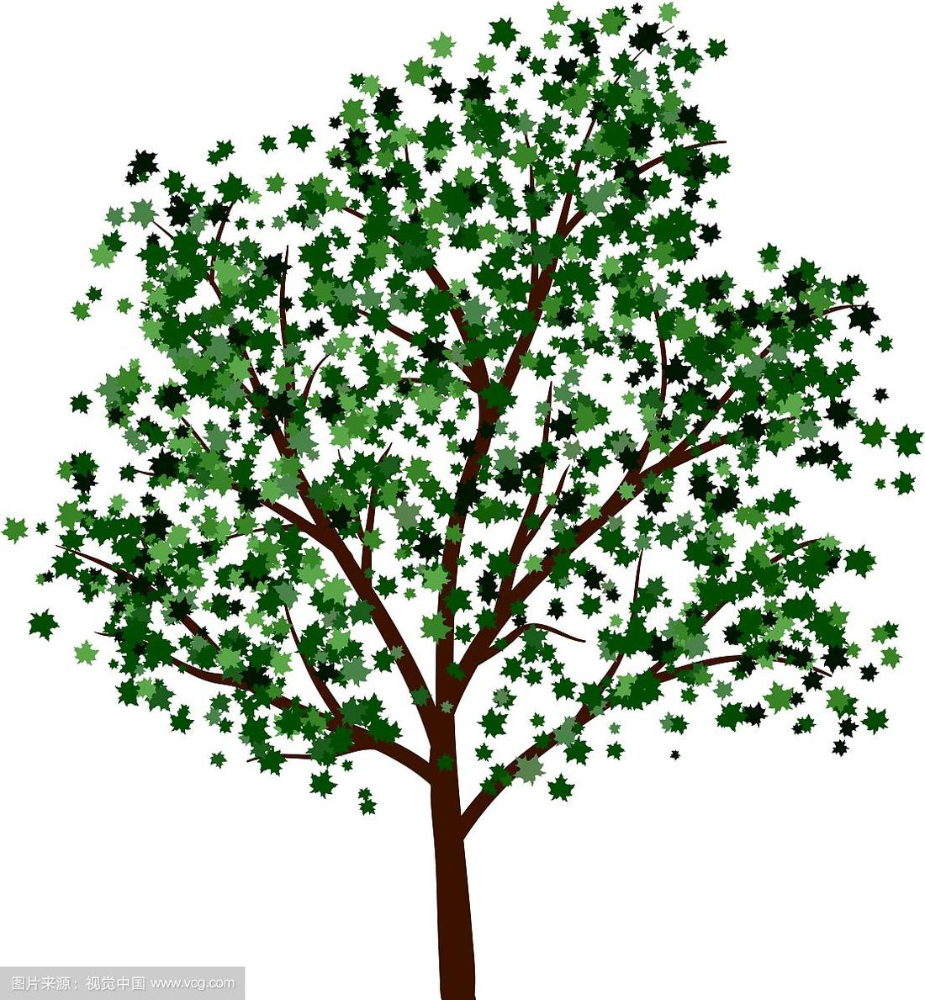
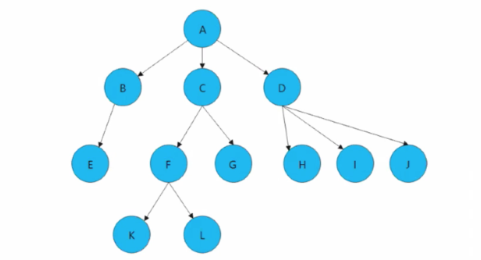
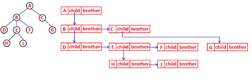
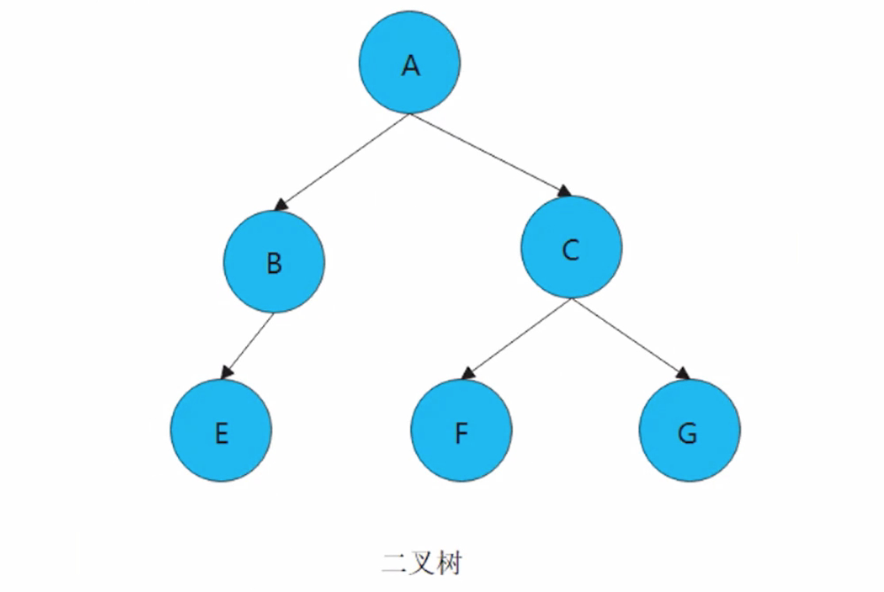
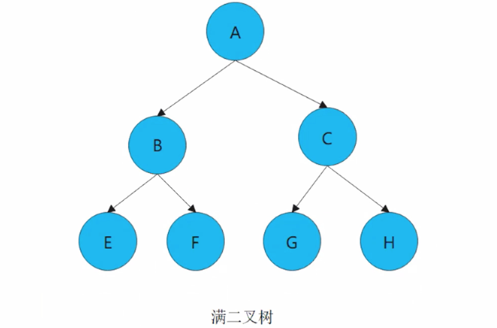
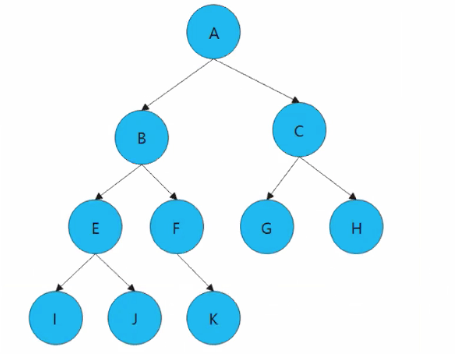

## 目录

- [一、树的基本概念](#一树的基本概念)
  - [1. 什么是树](#1-什么是树)
  - [2. 树的相关知识点](#2-树的相关知识点)
  - [3. 树的表示方法](#3-树的表示方法)
- [二、二叉树](#二二叉树)
  - [1. 二叉树的概念](#1-二叉树的概念)
  - [2. 二叉树的创建](#2-二叉树的创建)
  - [3. 树的大小和深度](#3-树的大小和深度)
  - [4. 二叉树的遍历](#4-二叉树的遍历)

> 画师：竹取工坊  
>  大佬们好！我是Mem0rin！现在正在准备自学转码。  
>  如果我的文章对你有帮助的话，欢迎关注我的主页[Mem0rin](https://blog.csdn.net/2501_93882415?spm=1010.2135.3001.10640)，欢迎互三，一起进步！

---

---

主要内容是如何构造出二叉树的数据结构，如何通过递归和非递归的方式完成对二叉树的四种遍历方式。

## 一、树的基本概念

### 1. 什么是树

  
 先看这么一张树的图片，从根延伸出枝干，枝干再继续分成多个叶子，我们把这样的模型抽象出来，称作树。  
 

我们对树的结构提出以下几点要求：

1. 树有一个特殊的节点，也就是根节点，根节点没有前驱。
2. 树的子树之间互不相交。
3. 除了根节点外，每个节点只有一个前驱（父节点），可以有多个后继。

因此树是没有环的。

### 2. 树的相关知识点

1. 结点的度：一个结点含有子树的个数称为该结点的度。
2. 树的度：一棵树中，所有结点度的最大值称为树的度。
3. 叶子结点或终端结点：度为0的结点称为叶结点。
4. 双亲结点或父结点：若一个结点含有子结点，则这个结点称为其子结点的父结点。
5. 孩子结点或子结点：一个结点含有的子树的根结点称为该结点的子结点。
6. 根结点：一棵树中，没有双亲结点的结点。
7. 结点的层次：从根开始定义起，根为第1层，根的子结点为第2层，以此类推。
8. 树的高度或深度：树中结点的最大层次。

### 3. 树的表示方法

由于树是非线性的，因此存储表示会更麻烦。我们可以用双亲表示法，孩子表示法，孩子双亲表示法，孩子兄弟表示法等方式进行表示，其中孩子兄弟表示法最为常用：

```java
class Node {
    int value; // 树中存储的数据
    Node firstChild; // 第一个孩子引用
    Node nextBrother; // 下一个兄弟引用
}
```



我们实现二叉树的时候会简化表示的方式，这些表示方式仅作了解即可。

## 二、二叉树

### 1. 二叉树的概念

二叉树是树的一种特殊形式，要求**树的度小于等于2**，并且二叉树的树有左右之分，次序不能颠倒，因此二叉树是**有序树**。如图：  
   
 有两种特殊的二叉树需要特别介绍：

1. 满二叉树：每一层的节点数都达到最大值，例如：一个满二叉树的层数是k，节点总数是2^k - 1。  
    
2. 完全二叉树：叶子结点只能出现在最下层和次下层，最后一层的叶子结点在左边连续，倒数第二层的叶子结点在右边连续，我们称为完全二叉树。（相当于是从左到右填充节点，一层填满了填下一层）  
      
    满二叉树是特殊的完全二叉树。

### 2. 二叉树的创建

同样树也有对应的顺序存储和链式存储的两种方式，本文只介绍链式存储。

#### 节点

我们采用孩子表示法来表示二叉树，跟链表类似，我们依旧采用内部类的方式定义二叉树的节点：

```java
// 孩子表示法
class TreeNode {
    int val; // 数据域
    TreeNode left; // 左孩子的引用，常常代表左孩子为根的整棵左子树
    TreeNode right; // 右孩子的引用，常常代表右孩子为根的整棵右子树
    TreeNode(int val) {
        this.val = val;
    }
}
```

#### 创建一个树

我们定义一个 `createTree()` 方法，用于创建简单的树。

```java
public TreeNode createTree() {
        TreeNode a = new TreeNode(1);
        TreeNode b = new TreeNode(2);
        TreeNode c = new TreeNode(3);
        TreeNode d = new TreeNode(4);
        TreeNode e = new TreeNode(5);
        TreeNode f = new TreeNode(6);

        a.left = b;
        a.right = c;
        b.left = d;
        c.left = e;
        c.right = f;

        return a;
    }
```

创造的二叉树如图：  
 

### 3. 树的大小和深度

#### size()

我们采用两种方法进行计算：

1. 内部递归输出

```java
public int size(TreeNode root) {
        int size = 0;
        if (root == null) {
            return 0;
        }
        return size(root.left) + size(root.right) + 1;
    }
```

2. 成员变量输出

```java
int size = 0;
    public void size2(TreeNode root) {
        if (root == null) {
            return;
        }
        size++;
        size2(root.left);
        size2(root.right);
    }
```

或者每次加入元素的时候 `size++`。但是因为不涉及添加元素方法的书写，因此不细说。

#### getHeight（）

思路是树的高度是左树和右树深度最大值加上1，需要用到 `Math` 类的 `max` 方法。

```java
public int getHeight(TreeNode root) {
        if (root == null) {
            return 0;
        }
        int height = 0;
        return Math.max(getHeight(root.left), getHeight(root.right)) + 1;
    }
```

### 4. 二叉树的遍历

树的遍历分为四种：前序遍历，中序遍历，后序遍历，层序遍历，遵循的顺序分别是：根-左树-右树，左树-根-右树，左树-右树-根，层内从左到右。前中后是指根在左树和右树的位置。  
 例如在上面给出的图中，四种遍历的结果如下：  
 1 2 4 3 5 6  
 4 2 1 5 3 6  
 4 2 5 6 3 1  
 1 2 3 4 5 6

#### 递归实现

四种方法的递归实现如下：  
 1.前序遍历

```java
public void preOrder(TreeNode root) {
        if (root == null) {
            return;
        }
        System.out.print(root.val + " ");
        preOrder(root.left);
        preOrder(root.right);
    }
```

2.中序遍历

```java
public void inOrder(TreeNode root) {
        if (root == null) {
            return;
        }
        inOrder(root.left);
        System.out.print(root.val + " ");
        inOrder(root.right);
    }
```

3.后序遍历

```java
public void postOrder(TreeNode root) {
        if (root == null) {
            return;
        }
        postOrder(root.left);
        postOrder(root.right);
        System.out.print(root.val + " ");
    }
```

4.层序遍历  
 为了实现层序遍历我们采用了辅助方法进行运算。

```java
public void levelOrder(TreeNode root, int k) {
        if (root == null) {
            return;
        }
        if (k == 1) {
            System.out.print(root.val + " ");
        }
        levelOrder(root.left, k - 1);
        levelOrder(root.right, k - 1);
    }

    public void levelOrder(TreeNode root) {
        int height = getHeight(root);
        for (int i = 1; i <= height; i++) {
            levelOrder(root, i);
        }
    }
```

#### 非递归实现

借助别的数据结构我们可以实现树的非递归遍历。  
 对于层序遍历，我们采用队列进行存储。具体如下：

```java
public void levelOrder1(TreeNode root) {
        if (root == null) {
            return;
        }
        Queue<TreeNode> q = new LinkedList<>();
        q.offer(root);
        while (!q.isEmpty()) {
            for (int i = 0; i < q.size(); i++) {
                TreeNode node = q.poll();
                System.out.println(node.val);
                if (node.left != null) {
                    q.offer(node.left);
                }
                if (node.right != null) {
                    q.offer(node.right);
                }
            }
        }
```

而前中后序遍历我们则是采用栈的数据结构。

前序遍历：

```java
    public void preOrder1(TreeNode root) {
        Stack<TreeNode> stack = new Stack<>();
        TreeNode cur = root;
        while (cur != null || !stack.isEmpty()) {
            while (cur != null) {
                stack.push(cur);
                System.out.print(cur.val + " ");
                cur = cur.left;
            }
            cur = stack.pop();
            cur = cur.right;
        }
    }
```

中序遍历：  
 我们只需要把输出的时间从入栈改成出栈即可：

```java
public void inOrder1(TreeNode root) {
        Stack<TreeNode> stack = new Stack<>();
        TreeNode cur = root;
        while (cur != null || !stack.isEmpty()) {
            while (cur != null) {
                stack.push(cur);
                cur = cur.left;
            }
            cur = stack.pop();
            System.out.print(cur.val + " ");
            cur = cur.right;
        }
    }
```

后序遍历：

会更加麻烦一点，特别是在右节点的判定上。

因此我们引入了 `top` 和 `prev` 变量，用于判断右树是否已经遍历完毕。

```java
    public void postOrder1(TreeNode root) {
        Stack<TreeNode> stack = new Stack<>();
        TreeNode cur = root;
        TreeNode prev = null;
        while (cur != null || !stack.isEmpty()) {
            while (cur != null) {
                stack.push(cur);
                cur = cur.left;
            }
            TreeNode top = stack.peek();
            if (top.right == null || prev == top.right) {
                System.out.print(top.val + " ");
                prev = top;
                stack.pop();
            } else {
                cur = top.right;
            }
        }
    }
```

下一篇博客讲一些经典的二叉树练习题。
