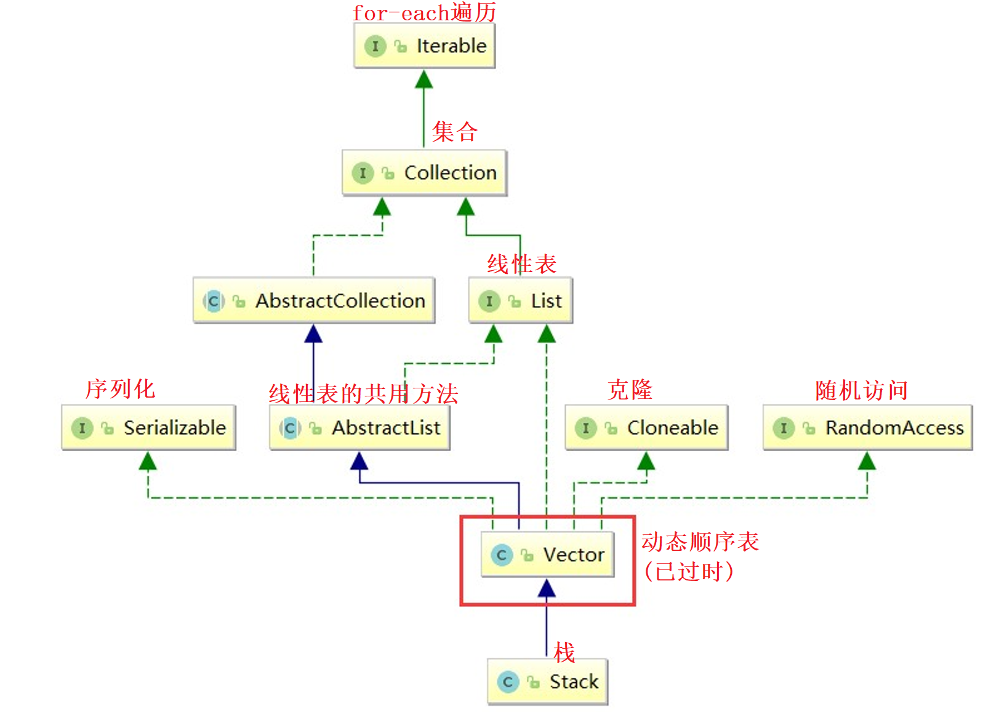
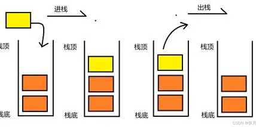
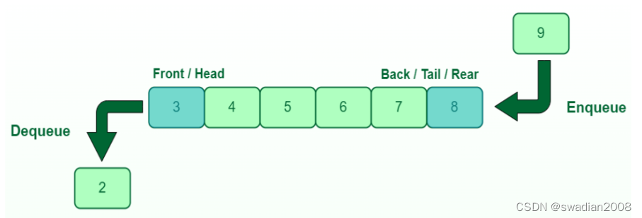
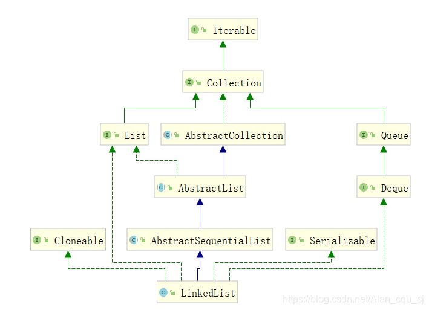
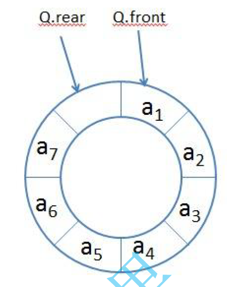

## 目录

- [一、栈](#一栈)
  - [1.栈的概念](#1栈的概念)
  - [2.节点设计](#2节点设计)
  - [3.方法的实现](#3方法的实现)
  - [4.栈的应用](#4栈的应用)
- [二、队列](#二队列)
  - [1.队列的节点设计](#1队列的节点设计)
  - [2.方法实现](#2方法实现)
  - [3.双端队列](#3双端队列)
- [三、循环队列](#三循环队列)

> 画师：竹取工坊  
>  大佬们好！我是Mem0rin！现在正在准备自学转码。  
>  如果我的文章对你有帮助的话，欢迎关注我的主页[Mem0rin](https://blog.csdn.net/2501_93882415?spm=1010.2135.3001.10640)，欢迎互三，一起进步！

---

---

主要内容是用前面学到的线性表实现栈和队列的实现和使用。我们只针对data为整数的情况进行模拟实现，如果需要了解泛型的具体实现请参考官方文档。

## 一、栈

### 1.栈的概念

想象一堆叠起来的餐盘，只能从上面放，从上面取出：  
   
 我们把这样“先进后出”的结构称作栈。这与我们之前学到的顺序表删除末尾元素是类似的。

事实上，从栈在集合结构的位置，我们也可以看到栈是动态顺序表 `Vector` 的子类，因此 `Stack` 类我们会用 `ArrayList` 模拟实现。：  
 

### 2.节点设计

我们采用数组的方式构建，类似于 `ArrayList`。

```java
    int[] array;
    int size;

    int DEFAULT_ARRAY_LENGTH = 3;

    public MyStack(){
        array = new int[DEFAULT_ARRAY_LENGTH];
    }
```

### 3.方法的实现

常用的栈的方法如下：

| 方法 | 功能 |
| --- | --- |
| E push(E e) | 将e入栈，并返回e |
| E pop() | 将栈顶元素出栈并返回 |
| E peek() | 获取栈顶元素 |
| int size() | 获取栈中有效元素个数 |
| boolean empty() | 检测栈是否为空 |

模拟实现如下，基本和 `ArrayList` 类似，因此不再赘述,下面放出经典的出栈和入栈的图解，希望能有所帮助：  
 

```java
public int push(int e){
        ensureCapacity();
        array[size++] = e;
        return e;
    }
    public int pop(){
        int e = peek();
        size--;
        return e;
    }
    public int peek(){
        if(empty()){
            throw new RuntimeException("栈为空，无法获取栈顶元素");
        }
        return array[size-1];
    }
    public int size() {

        return size;
    }
    public boolean empty(){
        return 0 == size;
    }
    private void ensureCapacity(){
        if(size == array.length){
            array = Arrays.copyOf(array, size*2);
        }
    }
```

### 4.栈的应用

栈的一个经典应用是**逆波兰式求四则运算**。  
 比如一个四则运算表达式为 `2 + (3 - 1) * (5 / 6)`，转换成逆波兰式就是 `231-56/*+`，简单的理解就是把计算符号丢到了两个数的后面，这样的好处在于可以避免括号的存在。

我们求解逆波兰式的原则是，当遍历到计算符号的时候，就读取计算符号前面两个数字，计算结果，再放回原来的式子中，以此循环。

比如上面的式子，我们往后遍历的时候，碰到 `-` 的时候，就往前找前面的两个数，找到了3，1，3为前数，因此是 `3 - 1 = 2` ，并把得到的结果2放回了原式，得到 `2256/*+`，以此往复。

栈在这个问题中非常方便，遇到数字则入栈，遇到计算符号就把前面的数字出栈，再把计算的结果重新入栈，直到最后遍历完栈内只剩一个数字，这就是逆波兰式的计算结果。

代码留给读者~（才不是自己代码太丑不敢贴）

## 二、队列

顾名思义是类似于排队的数据结构，顺序是“先进先出”，图例如下：  
 队列的集合位置如下：  
   
 可以看到队列（Queue）接口是由双向链表 `LinkedList` 类进行实现的，在使用的过程中也依赖于 `LinkedList` 的实例化（因为接口无法实例化），因此在这篇文章里队列也依靠双向链表实现。

其实用数组实现队列也是可行的，在Java中也有用顺序表实现队列接口的类，这样的思想相当于是设置一个数组，如果出队，则把数组的head++，如果入队，就把数组的last++，但是这样会带来一定的内存浪费！比如如果我出队了100个元素，那么就有400个字节被浪费！因此更常用的，我们会用链式结构进行模拟。

### 1.队列的节点设计

和双向链表一样，我们用ListNode的内部类进行队列的节点构造。特别的，为了出队和入队操作的方便，我们设置了 `first` 和 `last` 指针指向队首和队尾。

```java
public static class ListNode{
	ListNode next;
	ListNode prev;
	int value;
	ListNode(int value){
		this.value = value;
	}
}
ListNode first; // 队头
ListNode last; // 队尾
int size = 0;
```

### 2.方法实现

常用的队列方法如下：

| 方法 | 功能 |
| --- | --- |
| boolean offer(E e) | 入队列 |
| E poll() | 出队列 |
| peek() | 获取队头元素 |
| int size() | 获取队列中有效元素个数 |
| boolean isEmpty() | 检测队列是否为空 |

入队和出队的操作一样可以参考下图：  
 

```java
// 入队列---向双向链表位置插入新节点
    public void offer(int e){
        ListNode newNode = new ListNode(e);
        if(first == null){
            first = newNode;
            // last = newNode;
        }else{
            last.next = newNode;
            newNode.prev = last;
            // last = newNode;
        }
        last = newNode;
        size++;
    }
    // 出队列---将双向链表第一个节点删除掉
    public int poll(){
    // 1. 队列为空
    // 2. 队列中只有一个元素----链表中只有一个节点---直接删除
    // 3. 队列中有多个元素---链表中有多个节点----将第一个节点删除
        int value = 0;
        if(first == null){
            throw new RuntimeException("队列为空");
        }else if(first == last){
            last = null;
            first = null;
        }else{
            value = first.value;
            first = first.next;
            first.prev.next = null;
            first.prev = null;
        }
        --size;
        return value;
    }
    // 获取队头元素---获取链表中第一个节点的值域
    public int peek(){
        if(first == null){
            throw new RuntimeException("队列为空");
        }
        return first.value;
    }
    public int size() {
        return size;
    }
    public boolean isEmpty(){
        return first == null;
    }
```

### 3.双端队列

接口`Deque`的双端队列可以实现两端的入队和出队，同样也依赖于 `LinkedList` 的实例化实现接口。

## 三、循环队列

循环队列是一个特殊的队列，因为他占据的空间固定，并且出队的空间可以被重新利用。

通常用数组进行实现，在数组中，我们用 `len` 储存队列的长度，并且指定 `head` 作为队列的头，指向第一个元素，用 `rear` 指向下一个元素入队的位置，也就是队列的尾的后一个位置。  
 得到的初步结构如下：

```java
	  private int rear = 0;
    private int head = 0;
    private int len = 0;
    int[] q;
	//构造一个长度为k的循环队列
    public MyCircularQueue(int k) {
        this.len = k + 1;
        q = new int[len];
    }
```

为什么 `len` 是 k + 1后面进行说明

我们再继续完成队列满和空的判断，首先当队列空的时候，不妨以初始状态为例，此时 `head == rear`，因此得到 `isEmpty()` 方法：

```java
    public boolean isEmpty() {
        return rear == head;
    }
```

但是在判断队列是否满的时候出现了问题，如图，如果我们把整个队列都填满才算队列是满的话，那么 `rear` 就会指向队首的 `head`，这就和 `isEmpty()`的判断条件一样了，那我们又怎么判断队列是满还是空呢？  
   
 解决方法在前面其实已经给出了，我们在队列中开辟一个“过渡节点”，这个节点不存放值，而是把队尾和队首隔开，从而当队列满的时候，指向的是过渡节点而不是队首。

那么现在的满的判断条件是 `(rear + 1) % len = head`，比如上图中len为8，`head`指向的索引为0的话，那么 `rear` 指向的索引就是7，满足条件，如果`head` 为7的话，`rear`指向的是6，同样也符合条件。

`head` 和 `rear` 的移动也遵循这样的模式，也就是 `head = (head + 1) % len`，`rear = (rear + 1) % len`。

这样我们还可以写出出队和入队的方法：

```java
    public boolean enQueue(int value) {
        if (isFull()) {
            return false;
        }
        q[rear] = value;
        rear = (rear + 1) % len;
        return true;
    }
    
    public boolean deQueue() {
        if (isEmpty()) {
            return false;
        }
        head = (head + 1) % len;
        return true;
    }
```

最后是查询队首和队尾元素的值的方法，`rear` 需要往前倒一个节点，同时为了防止索引越界，因此我们采用了很常用的 `(rear - 1 + len) % len`，通过加上额外的len来避免分类讨论：

```java
    public int Front() {
        if (isEmpty()) {
            return -1;
        }
        return q[head];
    }
    
    public int Rear() {
        if (isEmpty()) {
            return -1;
        }
        return q[(rear - 1 + len) % len];
    }
```

二叉树东西有点多，有空更。
