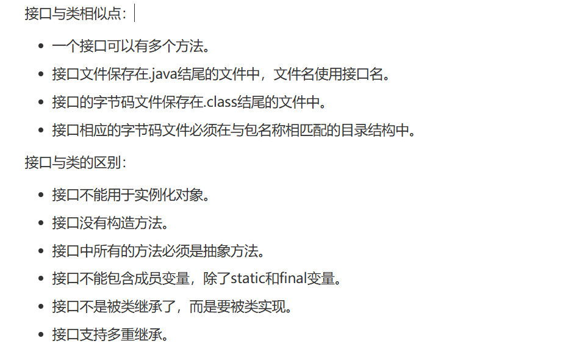

## 目录

- [一、接口的定义](#一接口的定义)
- [二、接口的使用](#二接口的使用)
- [三、接口的继承](#三接口的继承)
- [四、接口的应用](#四接口的应用)

> 画师：竹取工坊  
>  大佬们好！我是Mem0rin！现在正在准备自学转码。  
>  如果我的文章对你有帮助的话，欢迎关注我的主页[Mem0rin](https://blog.csdn.net/2501_93882415?spm=1010.2135.3001.10640)，欢迎互三，一起进步！

前言：在现实中我们会遇到很多的接口：Type-C， USB，以及3.5mm耳机接口等等，这些接口能够推行的重要原因是：通用。

也就是说，接口作为公共的规范，是具有普遍性的抽象方法的集合。因此在Java中我们定义了接口（interface），作为抽象方法的集合。

## 一、接口的定义

在Java中，接口的定义是把定义类的class改成interface即可。

```java
public interface IAnimal {
    public void eat();//在接口中，方法默认是public abstract的
    public void travel();
    int a = 1;//在接口中，成员变量默认是public static final的
}
```

在接口中，成员变量是默认被 `public static final` 修饰的，成员方法默认是被 `public abstract` 修饰的，因此在接口的成员方法和抽象方法一样，是没有主体的。

并且接口内是不允许出现静态代码块和构造方法的。

```java
public interface IAnimal {
    //编译出错
    public IAnimal() {
    
    }
    {}//编译出错
```

## 二、接口的使用

同时一个设备可以拥有多个接口，因此在使用过程中我们希望一个类可以实现多个接口，而不是继承中只能有一个父类。

在Java中，接口不能直接使用，我们用 `implements` 关键词来实现接口。

```java
public class Dog implements IAnimal{

    private String name;

    public Dog(String name) {
        this.name = name;
    }

    public void eat(){
        System.out.println("Dog eats");
    }

    public void travel(){
        System.out.println("Dog travels");
    }

    public int noOfLegs(){
        return 0;
    }

    public static void main(String args[]){
        Dog dog = new Dog("旺财");
        dog.eat();
        dog.travel();
    }
}
```

在具体的接口实现过程中，需要注意的是：

在实现接口的时候，需要重写接口的所有方法，除非实现接口的类本身也是抽象类（因为接口的方法默认是 `public abstract` 的）。

一个类可以实现多个接口，在类声明中语句类似于：

```
... implements 接口名称[, 其他接口, 其他接口..., ...] ...
```

接口和类的异同见下图：



## 三、接口的继承

接口可以用 `extends` 关键字继承另一个接口，子接口会继承父接口的方法，比如以下实例：

```java
public interface Sports
{
   public void setHomeTeam(String name);
   public void setVisitingTeam(String name);
}

public interface Football extends Sports
{
   public void homeTeamScored(int points);
   public void visitingTeamScored(int points);
   public void endOfQuarter(int quarter);
}

public interface Hockey extends Sports
{
   public void homeGoalScored();
   public void visitingGoalScored();
   public void endOfPeriod(int period);
   public void overtimePeriod(int ot);
}
```

## 四、接口的应用

我们说继承是 `xx IS-A xxx`，而接口则是 `xxx具有某种属性`，具体来讲，如果有 `Dog`， `Cat`， `Duck` 类，我们可以把三者抽象成一个 `Animal` 类，也可以只把部分对象的属性提取出来，比如 `Dog` 和 `Duck` 都会游泳，那我们就可以创建一个 `ISwimming` 的类，用来实现游泳的功能。

照着这样的思想我们可以写出以下示例：

`Animal` 类：

```java
public class Animal {
    public String name;

    public Animal(String name) {
        this.name = name;
    }

}
```

`IFlying`、 `ISwimming`、 `IRunning`的接口：

```java
public interface IFlying {
    void fly();
}
public interface ISwimming {
    void swim();
}
public interface IRunning {
    void run();
}
```

`Bird` 类：可以走可以飞

```java
public class Bird extends Animal implements IFlying, IRunning{

    public Bird(String name) {
        super(name);
    }

    public void fly() {
        System.out.println("小鸟在飞");
    }

    public void run() {
        System.out.println("小鸟在走");
    }
}
```

`Dog` 类：可以走可以游泳

```java
public class Dog extends Animal implements IRunning, ISwimming{
    public Dog(String name) {
        super(name);
    }

    public void run() {
        System.out.println("小狗在走");
    }

    public void swim() {
        System.out.println("小狗在游泳");
    }
}
```

`Duck`类：可以走可以飞可以游泳

```java
public class Duck extends Animal implements ISwimming, IFlying, IRunning{

    public Duck(String name) {
        super(name);
    }

    public void fly() {
        System.out.println("鸭子在飞");
    }

    public void run() {
        System.out.println("鸭子在走");
    }

    public void swim() {
        System.out.println("鸭子在游泳");
    }

}
```

最后我们用 `Test` 类测试代码：

```java
public class Test {
    public static void swim(ISwimming swim) {
        System.out.println("执行swim()");
        swim.swim();
    }

    public static void run(IRunning run) {
        System.out.println("执行run()");
        run.run();
    }

    public static void fly(IFlying fly) {
        System.out.println("执行fly()");
        fly.fly();
    }

    public static void main(String[] args) {
        Dog dog = new Dog("旺财");
        run(dog);
        swim(dog);

        Bird bird = new Bird("jiji");
        run(bird);
        fly(bird);

        Duck duck = new Duck("gaga");
        run(duck);
        swim(duck);
        fly(duck);

    }

}
```

得到的结果如下：

```
执行run()
小狗在走
执行swim()
小狗在游泳
执行run()
小鸟在走
执行fly()
小鸟在飞
执行run()
鸭子在走
执行swim()
鸭子在游泳
执行fly()
鸭子在飞
```

这也是多态的一种体现。
