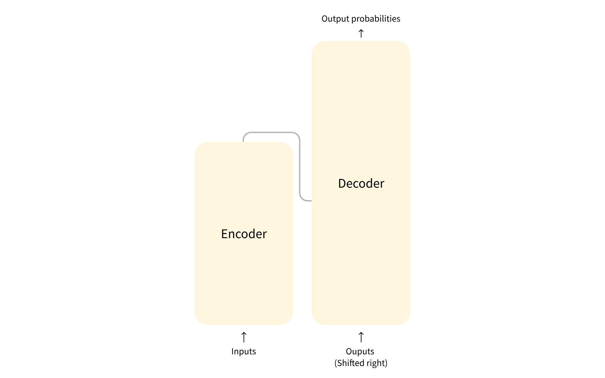

## 目录

- [一、自然语言处理（NLP）](#一自然语言处理nlp)
- [二、Transformer 架构的组成](#二transformer-架构的组成)
  - [编码器模型（自编码模型）](#编码器模型自编码模型)
  - [解码器模型（自回归模型）](#解码器模型自回归模型)
  - [编码器-解码器模型（序列到序列模型）](#编码器-解码器模型序列到序列模型)

> 画师：竹取工坊  
>  大佬们好！我是Mem0rin！现在正在准备自学转码。  
>  如果我的文章对你有帮助的话，欢迎关注我的主页[Mem0rin](https://blog.csdn.net/2501_93882415?spm=1010.2135.3001.10640)，欢迎互三，一起进步！

---

---

Transformer 模型大致可以分为以下三类：

- GPT-like（自回归 Transformer 模型）
- BERT-like（自动编码 Transformer 模型）
- BART/T5-like (序列到序列 Transformer 模型)

这样的分类是根据 Transformer 架构的使用部分决定的，下面会对此进行简单阐述。

学习网站来自于[Hugging Face](https://huggingface.co/learn/llm-course/zh-CN/chapter0/1)。

## 一、自然语言处理（NLP）

NLP 是语言学和机器学习交叉领域，专注于理解与人类语言相关的一切。NLP 任务的目标不仅是单独理解单个单词，而且是能够理解这些单词的上下文。下面是常见的 NLP 任务场景

- 对整个句子进行分类
- 对句子中的每个词进行分类
- 生成文本内容
- 从文本中提取答案
- 从输入文本生成新句子

## 二、Transformer 架构的组成

在前面的文章中我们已经简单说了一下 Transformer 架构的组成，分为编码器和解码器，分区如图所示：  
 他们在自然语言处理上具有各自的作用，编码器**从输入中获得理解**，解码器负责生成输出，并且两者可以并不是完全的依赖关系，可以单独运行。

因此根据自然语言处理的任务需求，Transformer 架构延伸出了三种类型的模型，分别为：编码器模型，解码器模型，编码器-解码器模型。下面会进行说明。

### 编码器模型（自编码模型）

在运行编码器的时候，编码器会把每一个词都转换成数字表示，称其为特征向量。由于编码器的**自注意机制**，这个词的数字表示不止与自己有关，还和这个词的上下文有关，更确切的来说，这个特征向量表示的是这个词在整个文本中的“含义”。

在每次计算过程中，注意力层都能访问整个句子的所有单词，这些模型通常具有“双向”（向前/向后）注意力，被称为自编码模型，典型的有BERT。

应用场景包括：完形填空、句子分类等，比如有大量的评论，根据其中的情感倾向给出一星到五星的评级。

### 解码器模型（自回归模型）

解码器模型只依赖解码器进行输出，和编码器类似，解码器也会把文本转换成数字表示。区别在于自注意机制上，解码器模型采用的是**掩码自注意机制**，不去在意右侧的文本，因此数字表示也只与左侧文本有关。这样的机制很适合生成文本，我们所熟知的大语言模型，如GPT、Gemini都是 **decoder-only 的自回归 Transformer 模型。**

之所以称为是自回归模型，是因为解码器模型生成文本的时候会把输出的结果重复利用作为后续输出的参照。下面是一个例子：  
   
 在生成 “My name is Sylvain." 的时候，解码器根据 My 生成了 name，然后 name 也作为输出的参照，解码器根据 My name 生成了 is，is 再作为输出的参照，直到生成完全部的文本。

这种阅读 `n` 个词并生成下一个词的方式我们称作**因果语言建模**，因为输出取决于过去和现在的输入，而不依赖于未来的输入。

### 编码器-解码器模型（序列到序列模型）

  
 编码器-解码器模型同时使用了编码器和解码器的两个部分，各个部分的工作原理是一样的，所以我们主要聚焦于这两个模型是如何联系起来的。

编码器会根据输入文本生成特征向量，特征向量和序列的起始词（目标序列开头的特殊起始标记）共同构成输出的参照，并且由于自回归的特性，后续生成的文本也会作为输出的参照。典型的大模型有 BART。

用翻译去类比的话，编码器就类似于翻译之前精读了一遍文本，并在脑子里有了文本的大致了解，之后通过脑子里的印象和已经翻译的文本去不断完善，从而达到翻译全文的目的。

这种模型在翻译文本、文章摘要等领域应用。
