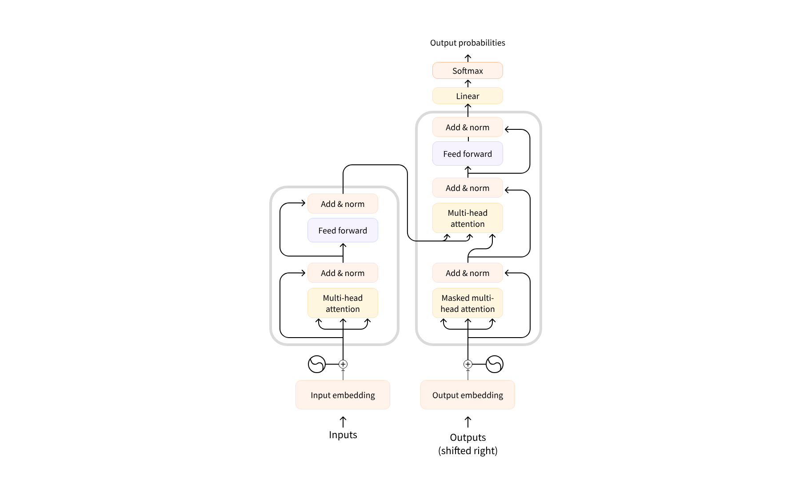

## 目录

- [前言](#前言)
- [一、什么是 Transformer ？](#一什么是-transformer)
  - [Transformer 架构](#transformer-架构)
  - [Transformer 模型](#transformer-模型)
- [二、Transformer 的构成](#二transformer-的构成)
- [三、一个简单的例子串起来看看](#三一个简单的例子串起来看看)

> 画师：竹取工坊  
>  大佬们好！我是Mem0rin！现在正在准备自学转码。  
>  如果我的文章对你有帮助的话，欢迎关注我的主页[Mem0rin](https://blog.csdn.net/2501_93882415?spm=1010.2135.3001.10640)，欢迎互三，一起进步！

---

---

## 前言

这是我在 agent 方向的初步探索，希望能在后端学习的过程中走完 LLM 等agent 相关的技术栈，分享出来希望能有所帮助。

这篇博客主要是整体进行一个简单的表述，具体的自然文本处理，模型训练和 Transformer 架构的结构等会在后面具体展开。

## 一、什么是 Transformer ？

### Transformer 架构

Transformer 架构是著名论文[《Attention Is All You Need》](https://arxiv.org/abs/1706.03762)提出的框架，最初用于翻译，后来被用于语言模型的自然语言处理上，诞生了一系列具有广泛影响力的模型，例如 GPT、BERT，并逐渐成为现在大模型的基础。

### Transformer 模型

Transformer 模型是已经通过**无监督学习**完成大量的原始文本训练的语言模型，类似于 GPT。这样的模型对训练过后的数据具有统计学意义上的理解，但是对于“特定的”任务可能表现就不尽如人意，因此针对特定任务的处理还需要对模型进行微调。

流程大概为：**预训练**得到语言模型，再通过微调**迁移学习**成我们需要的模型。具体的内容会在后面的**模型训练**板块讲到。

## 二、Transformer 的构成

最初的 Transformer 架构由两部分组成：编码器和解码器。图示如下：  
 

左边的部分为编码器，负责接收输入，通过自注意机制建立词和词之间的权重关联，用数字表示（计算其高级表示条目），传输给解码器。

右侧的部分为解码器，接收编码器的输出和用于预测生成的其他输入，预测的 output 可能会在之后重复使用（自回归）

这两个部分都基于 Transformer 的一个重要特性：注意力层，负责告诉模型在处理单词的时候对于不同单词的重视（或忽略）程度。

在编码器中体现为自注意机制，分析原文本词和词之间的关联。在解码器中期限为自注意力和交叉注意力的结合，一方面通过掩码注意力机制生成文本，（右上角）一方面通过编码器的输出判断输出的准确性（右下角）。具体的机制会在后面说明。

用一个翻译的例子说明：

## 三、一个简单的例子串起来看看

你是一个专业的翻译员（语言模型），经过大量的英语文本的学习（预学习）已经掌握了英语的相关知识，现在要求你去翻译美国文学作品，由于文学的写作方式，美国的风土人情等专业术语和表达还有所欠缺，因此你带着专业的英语知识学习了对应的知识点（微调，迁移学习），具备了翻译出信达雅的文学作品的能力。

在翻译一个作品时，你先精读了一遍原文本，对词和文章的联系有了整体的认知（编码层自注意力），之后着手进行翻译，一方面你一边翻译一边审查你前面翻译的文本，确定下面要写的翻译文本是通顺且符合语境的（解码层自注意力），另一方面，因为你已经对文章有了整体的认知，因此也可以判断这段文本是忠于原文的（解码层交叉注意力）。并且你会标注上一些不需要关注的单词（比如自己阅读的批注），避免对原文的翻译产生干扰（注意力掩码层）
