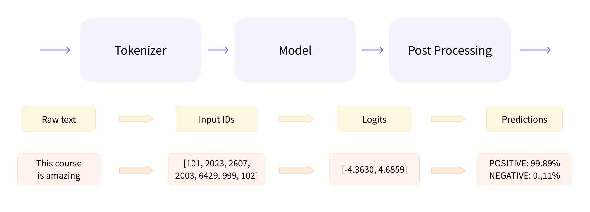
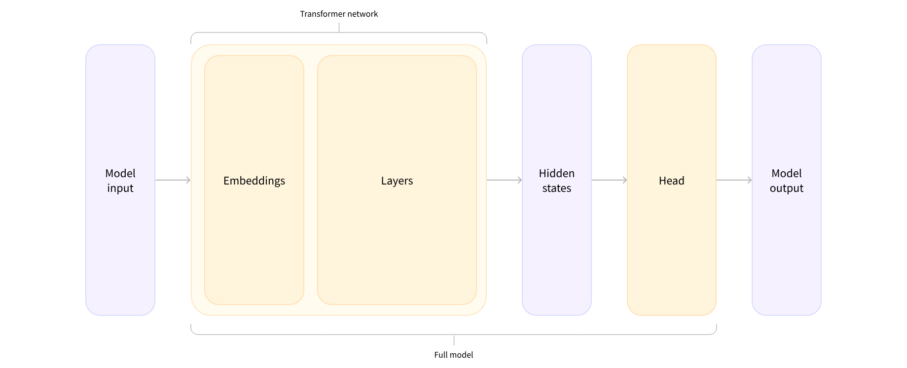

## 目录

- [一、pipeline() 函数的内部处理](#一pipeline-函数的内部处理)
- [二、Tokenizer](#二tokenizer)
  - [1. word-based](#1-word-based)
  - [2. character-based](#2-character-based)
  - [3. subword-based](#3-subword-based)
  - [4. 代码说明](#4-代码说明)
- [三、模型计算原理](#三模型计算原理)
  - [高维向量](#高维向量)
  - [模型头处理](#模型头处理)
- [四、模型计算流程](#四模型计算流程)
  - [1. 把句子转换成张量：](#1-把句子转换成张量)
  - [2. 处理多个序列](#2-处理多个序列)
- [五、后处理](#五后处理)
- [六、最后复习一下](#六最后复习一下)

> 画师：竹取工坊  
>  大佬们好！我是Mem0rin！现在正在准备自学转码。  
>  如果我的文章对你有帮助的话，欢迎关注我的主页[Mem0rin](https://blog.csdn.net/2501_93882415?spm=1010.2135.3001.10640)，一起进步！

---

---

给 LLM 基础收个尾然后就开 agent 了。希望这三篇博客可以让读者有一个 Transformer 的大致概念，希望我也是。

学习资料来自于[Hugging Face](https://huggingface.co/learn/llm-course/zh-CN/chapter2/2)。欢迎一起学习交流经验。

## 一、pipeline() 函数的内部处理

在下列代码中：

```python
from transformers import pipeline

classifier = pipeline("sentiment-analysis")
classifier(
    [
        "I've been waiting for a HuggingFace course my whole life.",
        "I hate this so much!",
    ]
)
```

`pipeline()` 函数内部经历了三个主要步骤：预处理、模型计算、后处理。  
   
 原始文本通过 tokenizer 进行分词，转换成计算机可处理的数字，模型再根据对应的任务转化成张量，最后再通过后处理转换为综合为 1 的概率分布，表明文本的情感倾向。

下面会从标记器（tokenizer）、模型计算和后处理进行说明。

## 二、Tokenizer

tokenizer 的任务是把文本转换成模型可以处理的数据，下面是三种比较经典的 tokenization 算法：

### 1. word-based

基本思想是把句子按照单词划分，并给每个单词都分配一个 ID，构成一个词汇表。比如 “I love you.” 就会拆分成 “I”、“love”、“you.”。

局限性在于：要覆盖一个语言需要的 token 是巨大的，并且我们无法得知相似的单词之间的关联性（比如 dog 和 dogs）。

如果我们只给常见的单词分配 token，并自定义一个 token 来表示词汇表以外的单词（“unknown" token，通常表示为[UNK] 或者 ＜unk＞)。那么当 tokenizer 看到过多这样的 token 就会损失信息。

### 2. character-based

基本思想是把句子按照字符划分，比如英语就是字母、标点符号和其他标志构成，这样词汇量就会大幅减少。

但这样的方法也并不是完美的，他意味着在部分语言（比如英语）每个 token 的信息量都会减少，并且需要处理大量的 token。

### 3. subword-based

基于前两种方法的思想，我们提出了基于子词的分词方法。子词分词的原则是：保留常见词，把罕见词拆分成有意义的子词。

例如，“annoyingly”可能被视为一个罕见的词，可以分解为“annoying”和“ly”。这两者都可能作为独立的子词并且出现得更频繁，同时“annoyingly”的含义通过“annoying”和“ly”的复合含义得以保留。

  
 这样的子词提供了大量的语义信息，只需要2个 token 就可以表示一个长词！这样我们在词汇量低的时候也能获得相对良好的覆盖率。这种方法在土耳其语等粘着型语言（agglutinative languages）中特别有用，你可以通过将子词串在一起来形成（几乎）任意长的复杂词。

目前的大语言模型基本都是 subword-based 的分词方法，或者是其分化，比如：

- Byte-level BPE，用于 GPT-2
- WordPiece，用于 BERT
- SentencePiece or Unigram，用于多个多语言模型

### 4. 代码说明

#### 分词

分词是通过 tokenizer 的 `tokenize()` 方法实现的：

```python
from transformers import AutoTokenizer

tokenizer = AutoTokenizer.from_pretrained("bert-base-cased")

sequence = "Using a Transformer network is simple"
tokens = tokenizer.tokenize(sequence)

print(tokens)
```

这个方法的返回是一个分词完毕的字符串：

```python
['Using', 'a', 'transform', '##er', 'network', 'is', 'simple']
```

#### 分配 imput ID

在分词完毕后，tokenizer 就会根据预处理得到的词汇表进行对应，返回对应的 input ID，token_type_ids 和 attention_mask。我们使用的是 `convert_tokens_to_ids()` 方法：

```python
ids = tokenizer.convert_tokens_to_ids(tokens)

print(ids)
```

得到的结果如下：

```python
{'input_ids': [101, 7993, 170, 11303, 1200, 2443, 1110, 3014, 102],
 'token_type_ids': [0, 0, 0, 0, 0, 0, 0, 0, 0],
 'attention_mask': [1, 1, 1, 1, 1, 1, 1, 1, 1]}
```

## 三、模型计算原理

当我们用分词器把文本转换成数字表示之后，我们需要通过模型计算转换成张量。

### 高维向量

首先 Transformer 主体会对 tokenizer 输出的 input ID 进行处理，输出一个高维向量，通常有三个维度：

- Batch size（批次大小）：一次处理的序列数（在我们的示例中为 2）。
- Sequence length（序列长度）：表示序列（句子）的长度（在我们的示例中为 16）。
- Hidden size（隐藏层大小）：每个模型输入的向量维度。（对于较小的模型，常见的是 768，对于较大的模型，这个数字可以达到 3072 或更多）。

```python
outputs = model(**inputs)
print(outputs.last_hidden_state.shape)
```

```python
torch.Size([2, 16, 768])
```

### 模型头处理

Transformer 模型输出的高维向量会传入到模型头进行处理。

模型头通常由一个或几个线性层组成，它的输入是隐状态的高维向量，它会并将其投影到不同的维度。  
   
 在此图中，模型由其嵌入层和后续层表示。嵌入层将 tokenize 后输入中的每个 inputs ID 转换为表示关联 token 的向量。后续层使用注意机制操纵这些向量，生成句子的最终表示。

Transformer 体系中针对于不同的任务需求会有相应的体系结构设计，以情感分类为例，我们需要一个带有序列分类头的模型（能够将句子分类为积极或消极）。因此，我们不选用 `AutoModel 类`，而是使用 `AutoModelForSequenceClassification` 。因为前面通过 `AutoModel` 得到的模型并没有加载 Model head。

```python
from transformers import AutoModelForSequenceClassification

checkpoint = "distilbert-base-uncased-finetuned-sst-2-english"
model = AutoModelForSequenceClassification.from_pretrained(checkpoint)
outputs = model(**inputs)
```

`outputs` 是模型头把输入向量的信息压缩后的结果。

## 四、模型计算流程

### 1. 把句子转换成张量：

```python
import torch
from transformers import AutoTokenizer, AutoModelForSequenceClassification

checkpoint = "distilbert-base-uncased-finetuned-sst-2-english"
tokenizer = AutoTokenizer.from_pretrained(checkpoint)
model = AutoModelForSequenceClassification.from_pretrained(checkpoint)

sequence = "I've been waiting for a HuggingFace course my whole life."

tokens = tokenizer.tokenize(sequence)
ids = tokenizer.convert_tokens_to_ids(tokens)
input_ids = torch.tensor(ids)
# 这一行会运行失败
model(input_ids)
```

这是因为 `torch.tensor()` 函数需要传入一个句子列表

```python
input_ids = torch.tensor([ids])
print("Input IDs:", input_ids)

output = model(input_ids)
print("Logits:", output.logits)
```

### 2. 处理多个序列

当我们需要处理多个句子的时候，可以把这些句子都放在一个句子列表里统一转换。

但是长度不同的词无法转换成张量，例如：

```python
batched_ids = [
    [200, 200, 200],
    [200, 200]
]
```

#### 填充

为了解决这个问题我们使用填充。 Padding 通过在值较少的句子中添加一个名为 `padding_id` 的特殊单词来确保我们所有的句子长度相同。

```python
padding_id = 100

batched_ids = [
    [200, 200, 200],
    [200, 200, padding_id],
]
```

#### attention_mask

之后我们尝试一下分别处理和批处理

```python
model = AutoModelForSequenceClassification.from_pretrained(checkpoint)

sequence1_ids = [[200, 200, 200]]
sequence2_ids = [[200, 200]]
batched_ids = [
    [200, 200, 200],
    [200, 200, tokenizer.pad_token_id],
]

print(model(torch.tensor(sequence1_ids)).logits)
print(model(torch.tensor(sequence2_ids)).logits)
print(model(torch.tensor(batched_ids)).logits)
```

得到的结果如下

```python
tensor([[ 1.5694, -1.3895]], grad_fn=<AddmmBackward>)
tensor([[ 0.5803, -0.4125]], grad_fn=<AddmmBackward>)
tensor([[ 1.5694, -1.3895],
        [ 1.3373, -1.2163]], grad_fn=<AddmmBackward>)
```

我们会发现批处理得到的第二行和 `sequence2` 对应的 logits 不一样，这是因为注意力机制会兼顾上下文，因此也会关注到多余的填充token。

我们需要告诉这些注意层忽略填充token，因此需要注意力掩码来实现（attention mask）。

#### 截断

面对更长的句子，我们由两种方案

- 使用支持更长序列长度的模型（如 LED、Longformer）
- 截断序列

截断序列我们可以通过设定 `max_sequence_length` 参数来阶段序列

```python
sequence = sequence[:max_sequence_length]
```

## 五、后处理

模型计算会返回一个张量，形如：

```python
tensor([[-1.5607,  1.6123],
        [ 4.1692, -3.3464]], grad_fn=<AddmmBackward>)
```

但是这样的模型预测是 `logit` （几何几率），而不是概率分布，因此我们还需要进行后处理，把它转化成概率。

要转换为概率，它们需要经过 [SoftMax](https://en.wikipedia.org/wiki/Softmax_function) 层（所有🤗Transformers 模型的输出都是 logits，因为训练时的损失函数通常会将最后的激活函数（如 SoftMax）与实际的损失函数（如交叉熵）融合）

```python
import torch

predictions = torch.nn.functional.softmax(outputs.logits, dim=-1)
print(predictions)
```

```python
tensor([[4.0195e-02, 9.5980e-01],
        [9.9946e-01, 5.4418e-04]], grad_fn=<SoftmaxBackward>)
```

从而得到模型预测如下：

- 第一句：消极的概率：0.0402，积极的概率：0.9598
- 第二句：消极的概率：0.9995，积极的概率：0.0005

## 六、最后复习一下

从原始文本到最终的输出：

```
原始文本
  ↓
Tokenizer 分词、分配ID
  ↓
input_ids + token_type_ids + attention_mask
  ↓
Transformer 主体进行模型计算
  ↓
hidden states，也就是高维向量
  ↓
模型头 model head 继续计算
  ↓
logits 张量
  ↓
后处理：softmax / label 映射
  ↓
最终结果：label + score
```
