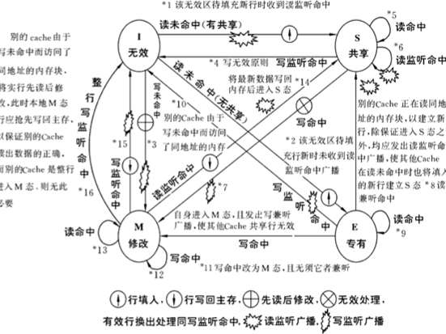
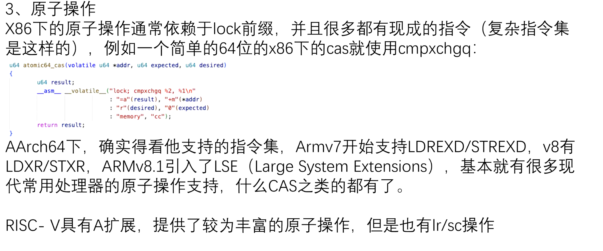
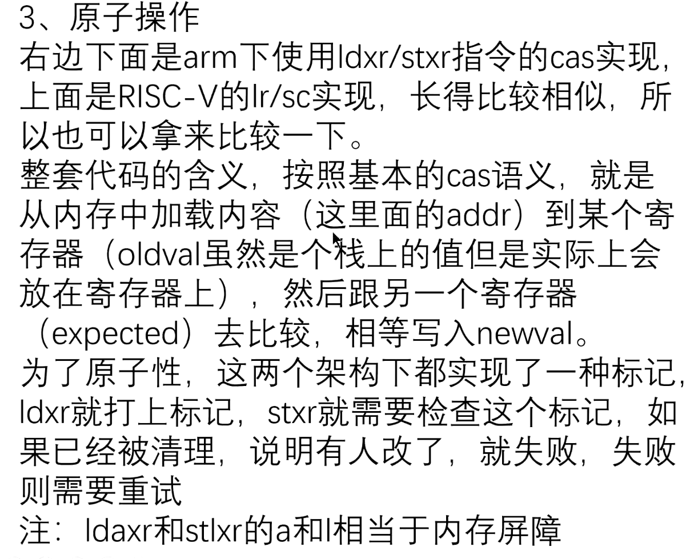
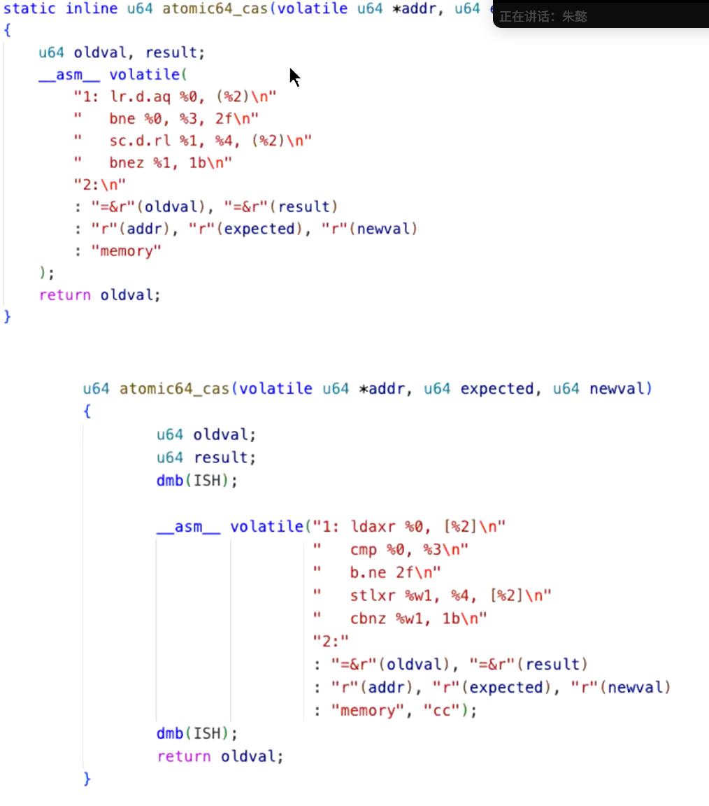

存个档  
内容来源于opencamp的公开课程。  
缓存一致性：让核心知道内存的更新（同一个簇，不同簇开销的区别）因此出现了可见域的概念

可见域Inner（簇内）/Outer（包括其他核心）/全局，需要手动塞入指令

MESI协议

原子操作：

有些操作是原子的，要么都成要么都不成，是很多锁的基石

一般都是有标准库的，但是有些不能很好的支持原子操作，要么第三方库要么自己搓  
×86下的原子操作，主要是因为它是个复杂指令集，针对这些东西它都有实现，依赖于一个所谓的 lock 的这个操作，它直接调用一个 compare exchange，它就实现了我下面示例的这个 CAS的一个操作嘛。

多核内核处理：percpu机制：划分好一个区域给某个CPU专门用的以及各种锁，无锁机制。

1.自组织自管理性：（内存依赖自己）

启动需要内存分配器，但是构造内存分配器也需要内存。

解决方法：自举，先给定一块静态内存，构造早期的内存分配器然后构造，最后迁移过去。

先要申请一个页面，管理页面的页表也需要页面：一开始写死页表

2.框架性：（对于成熟的OS内核而言）

内核设计：用户和驱动开发者，需要良好的框架（Linux）鲁棒性

防御性：防用户，用户不可靠，可能传入不可靠的syscall参数，考虑策略之外的攻击

防自己：写bug很正常，需要做好基本的检查，注意好错误处理，能够传递出log信息
