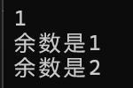

## 目录

- [分支语句](#分支语句)
  - [1.if语句](#1if语句)
  - [2.switch语句（多条分支）](#2switch语句多条分支)
  - [3.条件操作符](#3条件操作符)

由于本人有一定的编程基础，因此会简略基础的语法的介绍，主要整理的是与python语法有所不同的部分。

## 分支语句

        主要分为两部分：if语句和switch语句，也会介绍条件操作符（三目运算符）

### 1.if语句

#### 基本格式：

```cpp
if (expression）
    statement
else if(expression)//if条件不成立
    statement
else//上面两个条件表达式都不成立
    statement
```

例如如下代码

```cpp
#define _CRT_SECURE_NO_WARNINGS 1
#include<stdio.h>

/*
Read A and print whether A is negative, positive or zero.

>>>1
a is positive
>>>-1
a is negative
>>>0
a is zero
*/
int main() {
	int a;
	scanf("%d", &a);
	if (a < 0)
		printf("a is negative\n");
	else if (a > 0)
		printf("a is positive\n");
	else
		printf("a is zero\n");
    return 0;

}
```

如果if语句之后需要执行多句语句，则需要用大括号把语句都括起来，否则就始终会执行。

```cpp
#define _CRT_SECURE_NO_WARNINGS 1
#include<stdio.h>


int main() {
	int a;
	scanf("%d", &a);
	if (a < 0)
		printf("a is negative\n");
		printf("This line is always printed\n");
	else if (a > 0) {
		printf("a is positive\n");
		printf("This line is not always printed\n");
	}
	else
		printf("a is zero\n");
    return 0;

}
```

if语句可以嵌套：

```cpp
#define _CRT_SECURE_NO_WARNINGS 1
#include<stdio.h>

/*
Read A's age and print whether A is a child or an adult.

>>>18
a is an adult
>>>5
a is a child
>>>0
a is a child
>>>-3
Error: Age cannot be negative.
*/
int main() {
	int a;
	scanf("%d", &a);
	if (a >= 0) {
		if (a < 18) {
			printf("a is a child\n");
		}
		else {
			printf("a is an adult\n");
		}
	}
	else 
		printf("Error: Age cannot be negative.\n");
    return 0;
}
```

#### 悬空else的匹配原则：

由于C语言对缩进没有硬性要求，所以else会和上文最近的if语句匹配而不是同一缩进的语句。

```cpp
#define _CRT_SECURE_NO_WARNINGS 1
#include<stdio.h>


int main() {
	int a;
	scanf("%d", &a);
	if (a >= 0) 
		if (a < 18) 
			printf("a is a child\n");
		
	else 
		printf("Error: Age cannot be negative.\n");
    return 0;
}

/*
>>>18
Error: Age cannot be negative.
*/
```

因为此时else匹配的if是if (a < 18)。

如果有大括号就不用考虑这个问题了，else不会冲进大括号里匹配if的。

### 2.switch语句（多条分支）

相当于把多个else if简略了。

基本用法：

```cpp
switch (expression)
{
    case value1: statement
    case value2: statement
    ...
    default: statement
}
```

会根据expression的值执行不同的case分支，如果输入的值都不符合case的条件，可以按照需求选择是否使用default语句。但和else语句不同的是，default语句的位置并没有要求，放在switch语句最前面也是可以的。

需要注意的是，expression语句必须是整型表达式。

case和后面的数字之间要有空格。即case 0：而不是case0 ：

例：

```cpp
#include <stdio.h>
int main()
{
    int n = 0;
    scanf("%d", &n);
    switch(n % 3)
    {
        case 0:
            printf("整除，余数为0\n");
            break;
        case 1:
            printf("余数是1\n");
            break;
        case 2:
            printf("余数是2\n");
            break;
        default:
            printf("Error");
    }
    return 0;
}

/*
>>>3
整除，余数为0
>>>4
余数是1
>>>5
余数是2
*/
```

但是如果删掉break的话，代码会继续往下执行，可能会执行其他case语句的代码，比如我删掉break之后，输入1结果如下：

利用这个性质我们还可以对不同分支的相同输出作简化。比如如果要判断今天是不是周末，可以这么写

```cpp
#define _CRT_SECURE_NO_WARNINGS 1
#include <stdio.h>
int main()
{
	int day = 0;
	scanf("%d", &day);
	switch (day)
	{
		case 1:
		case 2:
		case 3:
		case 4:
		case 5:
			printf("工作日\n");
			break;
		case 6:
		case 7:
			printf("周末\n");
			break;
	}
	return 0;
}

/*
>>>3
工作日
>>>6
周末
*/
```

这是因为case 3条件满足之后，会一路往下执行，然后就会把case 5的语句执行了，因此1到5都有共同的输出值。

### 3.条件操作符

也叫三目表达式，形式为

```cpp
expression1?expression2:expression3
```

例如

```cpp
#define _CRT_SECURE_NO_WARNINGS 1
#include <stdio.h>
int main()
{
	int a = 0;
	int b = 0;
	b = (a ? 3 : 5);
	printf("%d %d", a, b);
	return 0;
}

/*
>>> 0 5
*/
```

三目操作符也可以嵌套：

```cpp
#define _CRT_SECURE_NO_WARNINGS 1
#include <stdio.h>
int main()
{
	int a, b, c, max;
	scanf("%d %d %d", &a, &b, &c);
	max = (a > b) ? ((a > c) ? a : c) : ((b > c) ? b : c);
	printf("max = %d", max);
	return 0;
}

/*
>>>3 2 1
max = 3
>>>1 2 3
max = 3
*/
```

虽然很简洁，但是会降低代码的可读性，慎重使用。

在输出的时候也可以用，例如：

```cpp
printf("The string \"%s\" is %s\n", str,
        (strcmp(str, "Hello") == 0) ? "a greeting" : "not a greeting");
```

三目运算符给我一种lambda函数的感觉，把几行的def语句压缩成一行。

下期讲循环结构。
